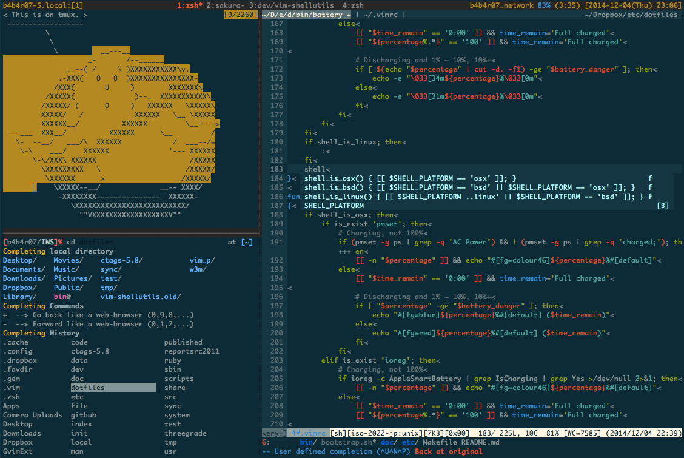

# The [B4B4R07](https://twitter.com/b4b4r07)'s dotfiles

[](https://dribbble.com/shots/1466768-dotfiles-logo)

[](https://travis-ci.org/b4b4r07/dotfiles "Build Status")
[](https://github.com/b4b4r07/dotfiles/issues "issue")
[](https://github.com/b4b4r07/dotfiles/releases/tag/stable "tag")
[](./doc/LICENSE-MIT.txt "License")
[](./doc/OSX.md "Platform")
[](./etc "etc")
[](https://bitdeli.com/free "Bitdeli Badge")

This is a repository with my [configuration files](http://en.wikipedia.org/wiki/Configuration_file), those that in Linux/OS X normally are these files under the `$HOME` directory that are hidden and preceded by a dot, AKA *dotfiles*.

## Overview

The primary goal is to increase CLI productivity on OS X, though many scripts run just fine on any POSIX implementation and it is easy to build environment again by running just [installation command](#oneliner) of one liner.

My primary OS is OS X (10.10.x) and some of these configurations are tuned to work on that platform. The bash files are more generic and friendly toward other Unix-based operating systems.

## Features

- **OS X** Yosemite (MacBook Air)
- **Zsh** 5.0.5
- **Vim** 7.4
- **Tmux** 1.9a
- **Terminal.app** (Full-screen)
- **Solarized** ([base 16](https://github.com/chriskempson/base16))

Click this image to see a larger version.



Note: You can clone or fork them freely, but I don't guarantee that they fit you.

**Download ZIP**

[](https://github.com/b4b4r07/dotfiles/archive/master.zip "Download ZIP")

## Installation

The easiest way to install this dotfiles is to open up a terminal, type the installation command below:

| Tools | <a name="oneliner">The installation command</a> |
|:---:|:---:|
| cURL | bash -c "$(curl -fsSL [dot.b4b4r07.com](https://raw.githubusercontent.com/b4b4r07/dotfiles/master/etc/install))" |
| Wget | bash -c "$(wget -qO - [dot.b4b4r07.com](https://raw.githubusercontent.com/b4b4r07/dotfiles/master/etc/install))" |

- It is almost the same as the command below except for executing through a Web site directly.

		$ make install

	It is not necessary to perform `make install` at all if this repository was installed by the [installation command](#oneliner).

- [Installation by Other Means](https://github.com/b4b4r07/dotfiles/wiki/Installation-manually)

**What's inside?**

1. Downloads this repository
2. Deploy (i.e. *copy* or *create symlink*) dot files to your home directory; `make deploy`
3. Run all programs for setup in `./etc/init/` directory; `make init` (**Optional**: when running the [installation command](#oneliner) specify `-s init` as an argument)

When the [installation command](#oneliner) format is not `curl -L URL | sh` but `sh -c "$(curl -L URL)"`, shell will be restart automatically. If this is not the case, it is necessary to restart your shell manually.

## Updating

To update later on, just run this command.

	$ make update

In addition, there are several git submodules included in this configuration. On a new installation these submodules need to be initialized and updated.

## Setup

### Initialize

All configuration files for setup is stored within the `etc/init/` directory. By running the command below, you can interactively setup all preferences.

	$ make init

To run `make init` immediately after running the [installation command](#oneliner):

	$ bash -c "$(curl -L dot.b4b4r07.com)" -s init

**Sample: Init scripts**

- [Build and install the original cutsom Vim](./etc/init/build_vim_by_myself.sh)
- [Translate the home directory into English](./etc/init/globalize_your_home_directory.sh)
- [Install antigen zsh plugin manager](./etc/init/install_zsh_plugin_manager_antigen.sh)
- [Install pygments generic syntax highlighter written in python](./etc/init/install_pygments.sh)
- [Install Homebrew the missing package manager for OS X](./etc/init/osx/install_homebrew.sh)
- [Install the CLI tool that comes with Xcode](./etc/init/osx/install_xcode_cli_tools.sh)
- [Run 'brew install' based on the Brewfile](./etc/init/osx/install_brew_packages.sh)
- [Run 'brew cask install' based on the Caskfile](./etc/init/osx/install_cask_packages.sh)
- [Sensible OS X defaults](./etc/init/osx/execute_osx_defaults.sh)
- [Setup Karabiner (formerly KeyRemap4MacBook)](./etc/init/osx/setup_kanabiner.sh)
- ...

For more information about initializing, see also [./etc/README.md](./etc/README.md)!!

### Vim

To install the Vim plugins, run this command.

	$ vim +NeoBundleInit +qall

Vim plugins are not installed from you just running the [installation command](#oneliner). To install the plugins, you must specify the `-c 'NeoBundleInit'` as an argument when starting Vim. By doing so, install immediately [neobundle.vim](https://github.com/Shougo/neobundle.vim) and other plugins (**requires**: `git` in `$PATH`, Vim 7.2+, a lot of time, Wi-Fi). 

To use these plugins effectively, features of Vim needs **normal or [more](http://www.drchip.org/astronaut/vim/vimfeat.html)**.

### Git

Make the configuration file for personal use. Copy and paste the following to personal configuration file, e.g. `~/.sh.local`

```bash
# Git credentials
# Not under version control to prevent people from
# accidentally committing with your details
GIT_AUTHOR_NAME="b4b4r07"
GIT_AUTHOR_EMAIL="b4b4r07@example.com"
GIT_COMMITTER_NAME="$GIT_AUTHOR_NAME"
GIT_COMMITTER_EMAIL="$GIT_AUTHOR_EMAIL"

# Set the credentials (modifies ~/.gitconfig)
git config --global user.name "$GIT_AUTHOR_NAME"
git config --global user.email "$GIT_AUTHOR_EMAIL"
```

### Zsh

The easiest way to change your shell is to use the `chsh` command. You can also give `chsh` the `-s` option; this will set your shell for you, without requiring you to enter an editor.

	$ chsh -s /bin/zsh

Note: The shell that you wish to use must be present in the `/etc/shells` file.

### OS X

**defaults** is a [command line](http://en.wikipedia.org/wiki/Command-line_interface) utility that manipulates [plist](http://en.wikipedia.org/wiki/Property_list) files. It can set many hidden settings and preferences in Mac OS X, and in individual applications. 
 
When setting up a new Mac, you may want to set some sensible OS X defaults:

```bash
$ make osx
```

- [OS X Daily](http://osxdaily.com/tag/defaults-write/)
- [defaults-write](http://www.defaults-write.com)

For more detail, [here](./doc/OSX.md).

###### Homebrew

This is a quick description of one of the most important apps that I use, [Brew](http://brew.sh). Since OS X does not have a native package manager that you can use from the command line, Brew (also known as HomeBrew), has filled in. A number of the applications that I use, from day to day, use Brew for installation.

For example, a simple `brew install coreutils` will install a [whole bunch of stuff](http://en.wikipedia.org/wiki/GNU_Core_Utilities), which is essential if you're used to working on Linux.

Brew is simple to install, and only has one requirement, Xcode Command Line tools:

	$ xcode-select --install

Now that you have the command line tools installed, you can run a single command to install Brew:

	$ ruby -e "$(curl -fsSL https://raw.githubusercontent.com/Homebrew/install/master/install)"

After Brew is installed, it's considered best practice to run the following commands:

	brew doctor
	brew update
	brew upgrade

When setting up a new Mac, you may want to install some common Homebrew formulae (after installing Homebrew, of course):

	make brew
	make cask

**Notes:**

- The order in `/etc/paths` file

	On those Mac OS machines where I install Homebrew I also edit `/etc/paths` to move the `/usr/local/bin` entry to the top of the list. This ensures that Homebrew-managed programs and libraries occur prior to `/usr/bin` and system-provided programs and libraries. 

	The resulting `/etc/paths` files looks like this:

	```
/usr/local/bin
/usr/bin
/bin
/usr/sbin
/sbin
	```

	The contents for the `$PATH` and their execute order are specified in the `/etc/paths` file.

- `brew bundle` is dead

	Therefore, cannot use `brew bundle path/to/Brewfile` to set up brews.
	
	> [What? "Warning: brew bundle is unsupported ..." #30815](https://github.com/Homebrew/homebrew/issues/30815)

	**Solution**: replace Brewfile with shell script.

## Components

- **bin/**: This is the primary directory for executable programs.
- **etc/init/**: Configuration file storage to be executed initially for setup.
- **etc/init/osx/**: Some configuration files for OS X storage.
- **etc/lib/**: Shell scripts Libraries
- **doc/man/**: Self-written program's manuals.
- **.loading/**: Any files ending in `.sh` get loaded into your environment.

## Credits

* Deeply inspired by [@cowboy's dotfiles](https://github.com/cowboy/dotfiles/blob/master/bin/dotfiles)
* Inspired by [@skwp's dotfiles](https://github.com/skwp/dotfiles)
* *Installation* section based on [@necolas's dotfiles](https://github.com/necolas/dotfiles)
* *OS X Hacks* section based on [@cowboy's dotfiles](https://github.com/cowboy/dotfiles/blob/master/README.md)
* *Components* section based on [@holman's dotfiles](https://github.com/holman/dotfiles)
* *Author* section and [*OS X defaults*](etc/init/osx/osx_defaults.sh) based on [@Mathias's dotfiles](https://github.com/mathiasbynens/dotfiles)
* My `README.md` layout based on [@zanshin's README.md](https://github.com/zanshin/dotfiles)
* My `Makefile` based on [@Tetsuji's dotfiles](https://github.com/xtetsuji/dotfiles)
* My `bootstrap.sh` based on [@Rocha's dotfiles](https://github.com/zenorocha/old-dotfiles)

## Author

| [](https://twitter.com/intent/follow?screen_name=b4b4r07 "Follow @b4b4r07 on Twitter") |
|:---:|
| [b4b4r07's Qiita](http://qiita.com/b4b4r07/ "b4b4r07 on Qiita") |


## Licence

Copyright (c) 2014 "BABAROT" b4b4r07

Licensed under the [MIT license](./doc/LICENSE-MIT.txt).

Unless attributed otherwise, everything is under the MIT licence (see [LICENCE](./doc/LICENSE-MIT.txt) for more info).

Some stuff is not from me, and without attribution, and I no longer remember where I got it from. I apologize for that.
