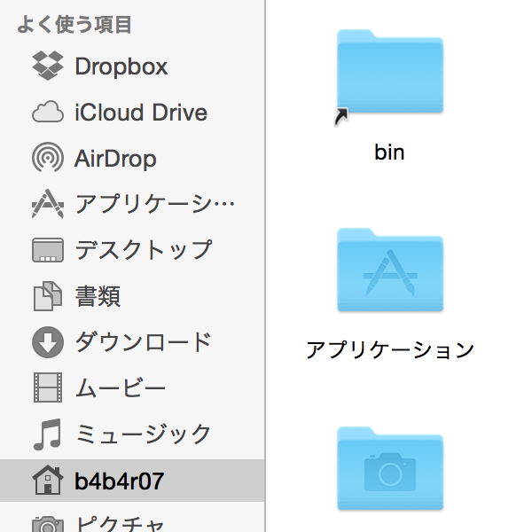
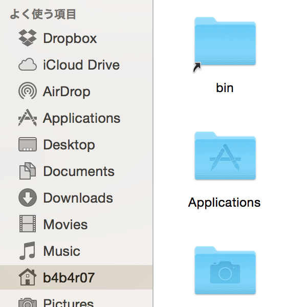

# OS X Documentation

[][License]

[License]: ../doc/LICENSE-MIT.txt

The goal of the OS X document page is to faithfully reproduce the command line environment on OS X that we usually use.

CLI environment that we want to build are mainly the following items.

- **Zsh** 5.0.5 or more
- **Tmux** 1.9 (==)
- **Vim** 7.4 or more (+clipboard, +lua)
- **Brew** 0.9.5
- **Go** 1.4 or more

Because there is a problem of dependency, we will resolve this in the optimal order.

# Brew

> Homebrew
>
> The missing package manager for OS X

This is a quick description of one of the most important apps that I use, [Brew](http://brew.sh). Since OS X does not have a native package manager that you can use from the command line, Brew (also known as HomeBrew), has filled in. A number of the applications that I use, from day to day, use Brew for installation.

For example, a simple `brew install coreutils` will install a [whole bunch of stuff](https://en.wikipedia.org/wiki/GNU_Core_Utilities), which is essential if you're used to working on Linux.

rew is simple to install, and only has one requirement, Xcode command-line tools:

```console
$ xcode-select --install
```

## Install Homebrew

```console
$ ruby -e "$(curl -fsSL https://raw.githubusercontent.com/Homebrew/install/master/install)"
```

Paste that at a Terminal prompt. The script explains what it will do and then pauses before it does it. There are more installation options [here](https://github.com/Homebrew/homebrew/blob/master/share/doc/homebrew/Installation.md#installation) (needed on 10.5).

After the installation:

```console
$ brew doctor
Your system is ready to brew.
```

When the check of Brew is finished by `brew doctor`, there is a need to upgrade to the latest packages in Homebrew.

```console
$ brew update
$ brew upgrade
```

## Install packages

When setting up a new Mac, you may want to install some common Homebrew formulae (after installing Homebrew, of course):

```console
$ brew tap Homebrew/bundle
$ brew bundle
```

`brew bundle` requires a single Brewfile written based on the grammar such as Ansible, but [Brewfile](../etc/init/assets/brew/Brewfile) is located in [`/etc/init/assets/brew`](../etc/init/assets/brew).

**Note:**

- The order in `/etc/paths` file

	On those Mac OS machines where I install Homebrew I also edit `/etc/paths` to move the `/usr/local/bin` entry to the top of the list. This ensures that Homebrew-managed programs and libraries occur prior to `/usr/bin` and system-provided programs and libraries. 

	The resulting `/etc/paths` files looks like this:

	```
	/usr/local/bin
	/usr/bin
	/bin
	/usr/sbin
	/sbin
	```

	The contents for the `$PATH` and their execute order are specified in the `/etc/paths` file.

- `brew bundle` is dead

	Therefore, cannot use `brew bundle path/to/Brewfile` to set up brews.
	
	> [What? "Warning: brew bundle is unsupported ..." #30815](https://github.com/Homebrew/homebrew/issues/30815)

	**Solution**: replace Brewfile with shell script.

Example: [Brewfile](../etc/init/assets/brew/Brewfile)

# Tmux

[](http://tmux.github.io)

> `tmux` is a terminal multiplexer. **What is a terminal multiplexer?** It lets you switch easily between several programs in one terminal, detach them (they keep running in the background) and reattach them to a different terminal. And do a lot more. See the [webpage](http://tmux.github.io).

## Install tmux

The easiest way to install tmux in OS X is to use Brew, type the following command at a Terminal prompt.

```console
$ brew install tmux
```

If you want to install tmux from source, you may want to  visit [github.com](https://github.com/tmux) and download it.

## Pasteboard for OS X

`reattach-to-user-namespace` is notes and workarounds for accessing the OS X pasteboard in tmux sessions

> Using the Mac OS X programs pbpaste and pbcopy under tmux does not work.
Other services and unpatched builds of screen are also affected.
>
> **Note:** Under Yosemite (and later) pasteboard access seems to work fine without the program from this repository.

1. Compile reattach-to-user-namespace from this repository. 

	Make it available in your PATH (or use the absolute pathname in the next step).

	```console
	$ make reattach-to-user-namespace
	$ cp reattach-to-user-namespace ~/bin
	```

	Alternatively, you can install it with Homebrew:

	```console
	$ brew install reattach-to-user-namespace
	```
	
2. Configure tmux to use this wrapper program to start the shell for each new window.

	In `.tmux.conf`:
	
	```conf
	set-option -g default-command "reattach-to-user-namespace -l zsh"
	```
	
	See the file [Usage.md](https://github.com/ChrisJohnsen/tmux-MacOSX-pasteboard/blob/master/Usage.md) for other configuration and usage techniques (conditional use for cross-platform configurations, fine-grained usage, etc.)
	
3. Restart your tmux server (or start a new one, or just reconfigure your existing one).

	To kill your existing tmux server (and everything running “inside” it!):
	
	```console
	$ tmux kill-server
	```

For more information, please visit [ChrisJohnsen/tmux-MacOSX-pasteboard](https://github.com/ChrisJohnsen/tmux-MacOSX-pasteboard).

Reference: 

- [How to Copy and Paste with tmux on Mac OS X](https://robots.thoughtbot.com/how-to-copy-and-paste-with-tmux-on-mac-os-x)

# Vim

[](http://www.vim.org)

>**What is Vim?**
>
>Vim is an almost compatible version of the UNIX editor Vi.  Many new features
have been added: multi-level undo, syntax highlighting, command line history,
on-line help, spell checking, filename completion, block operations, etc.
There is also a Graphical User Interface (GUI) available.  See
"runtime/doc/vi_diff.txt" for differences with Vi.

To install vim is available on Homebrew.

```console
$ brew install vim
```

To build vim from source:

See documentation of [Vim.md](Vim.md).

Check if vim has `+clipboard` and `+lua`.

```console
$ vim --version
VIM - Vi IMproved 7.4 (2013 Aug 10, compiled Jun 25 2015 09:25:44)
MacOS X (unix) version
Included patches: 1-712
Compiled by Homebrew
Huge version without GUI.  Features included (+) or not (-):
...
+clipboard       +iconv           +path_extra      -toolbar
...
+dialog_con      +lua             +rightleft       +windows
...
   system vimrc file: "$VIM/vimrc"
     user vimrc file: "$HOME/.vimrc"
 2nd user vimrc file: "~/.vim/vimrc"
      user exrc file: "$HOME/.exrc"
  fall-back for $VIM: "/usr/local/share/vim"
Compilation: /usr/bin/clang -c -I. ...      
Linking: /usr/bin/clang ...   
```

# Go


> The Go programming language is an open source project to make programmers more productive.
>
> Go is expressive, concise, clean, and efficient. Its concurrency mechanisms make it easy to write programs that get the most out of multicore and networked machines, while its novel type system enables flexible and modular program construction. Go compiles quickly to machine code yet has the convenience of garbage collection and the power of run-time reflection. It's a fast, statically typed, compiled language that feels like a dynamically typed, interpreted language.

## Getting Started

To use Homebrew:

```console
$ brew install go --cross-compile-common
```

If you want to compile Go language from source or install it by other methods of installation, please see [golang.org](http://golang.org/doc/install) documentation.

Check that Go is installed correctly by building a simple program, as follows.

```console
$ go version
go version go1.4.2 darwin/amd64
```

If you see the "go version go1.x.x" message then your Go installation is working.

... gogogo 

## Install go packages

Go packages that you use usually can be installed by `goal` command that I have developed on [b4b4r07/goal](https://github.com/b4b4r07/goal).

```console
$ brew tap b4b4r07/goal
$ brew install goal
```

`goal` command will install based on the package list written in TOML format such as the following:

```toml
repos = [
    "github.com/b4b4r07/gch",
    "github.com/b4b4r07/go-pipe",
    "github.com/b4b4r07/gomi/...",
    #...,
]
```


Incidentally, `goal` is cross platform CLI application, this means that it can work even Linux and Windows.

***`goal`'s DEMO:***

[](https://github.com/b4b4r07/goal "b4b4r07/goal")

Example: [config.toml](../etc/init/assets/go/config.toml)


# Miscellaneous

## defaults

**defaults** is a [command line](http://en.wikipedia.org/wiki/Command-line_interface) utility that manipulates [plist](http://en.wikipedia.org/wiki/Property_list) files. It can set many hidden settings and preferences in Mac OS X, and in individual applications.

```console
$ cat $DOTPATH/etc/init/osx/defaults.sh
#!/bin/bash

#...

. $DOTPATH/etc/lib/vital.sh

is_osx || die "osx only"

# Dashboard {{{1
set_dashboard_preferences()
{
    # Disable Dashboard
    defaults write com.apple.dashboard mcx-disabled -bool true
}

# Dock {{{1
set_dock_preferences()
{
    # Automatically hide or show the Dock

#...
```

## Globalize directory name

For OS X 10.9 or more:

```console
$ cd /System/Library/CoreServices/SystemFolderLocalizations/ja.lproj
$ sudo mv SystemFolderLocalizations.strings SystemFolderLocalizations.strings.back
$ sudo cp ../en.lproj/SystemFolderLocalizations.strings .
$ killall Finder
```

For OS X 10.8 or less:

```console
$ cd /System/Library/CoreServices/SystemFolderLocalizations/Japanese.lproj
$ sudo mv SystemFolderLocalizations.strings SystemFolderLocalizations.strings.back
$ sudo cp ../en.lproj/SystemFolderLocalizations.strings .
$ killall Finder
```


**Before:**



**After:**

